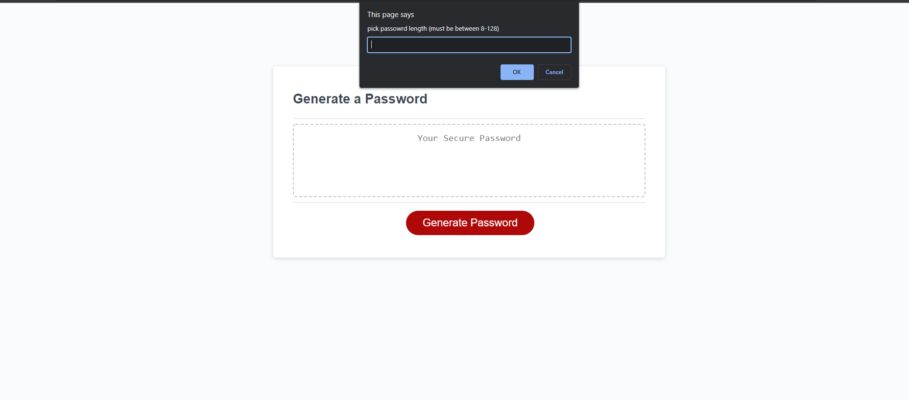

I made the generator give out prompts to allow the user to choose the crietrias they wanted. I made the generator make passwords with lowercase, uppercase, numbers, and symbols.
I made the generator put out random characters based of off the user's selections. However I had some problems making it maintain the amount of characters the user chooses.
https://github.com/KappaMustafa/password-generator
https://kappamustafa.github.io/password-generator/

